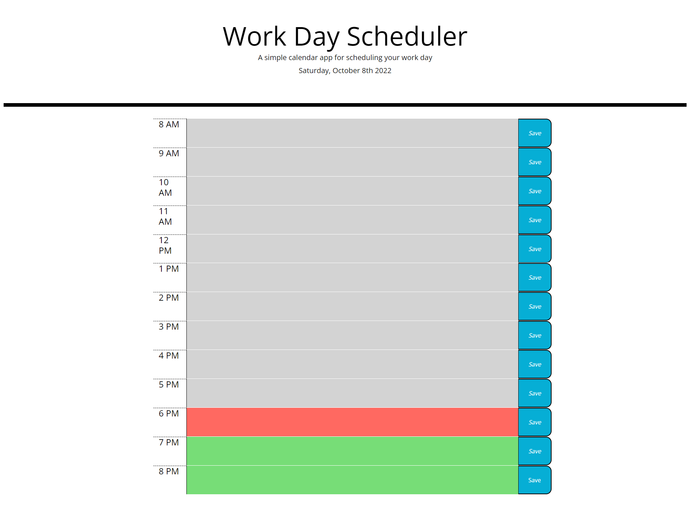

# <Workday Scheduler>

## Description

This project was to create / update code using bootstrap and jQuery and make a functioning day calender that stores information in local storage that is placed into the text area next to it, and recall that information back to the stored area on load.

## Installation

n/a

## Usage

 https://tab-y.github.io/work-day-scheduler/

## Credits

n/a

## License

See license in repo.
